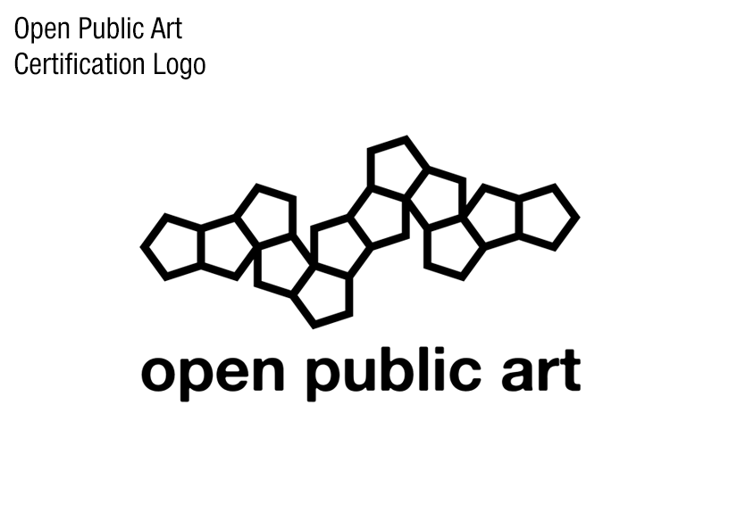
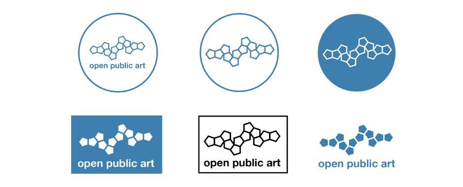

# Welcome

This repository contains artwork and usage guidelines for the graphic mark for Open Public Art,  hosted by New American Public Art. The mark itself can be seen here:

When self-certifying, you may use the contained design files, provided in a range of file formats, to identify your work as Open Public Art, so long as you respect the terms of the conditionals of the Open Public Art definition.

This repository solely for the graphic element mark of Open Public Art.

# Usage

The mark uses one color; a slightly unsaturated blue. The color is shown here:

|      | blue             |
|------|------------------|
| hex  | #3d80af | #3d80af |
| RGB  | 61, 128, 175,   |

## Variations

Variations of the mark can be used in aesthetically necessary cases.

# Formats

The "master" copy is in PDF, and we're starting with an initial list of commonly readable formats. The formats available now include:

- .PDF
- .AI

You can find these file formats in the `/templates/` folder of this repository.

# Attribution

The mark is 1 of 43,380 nets of the regular dodecahedron. It is meant to represent the one of many rational examinations of complex forms.
